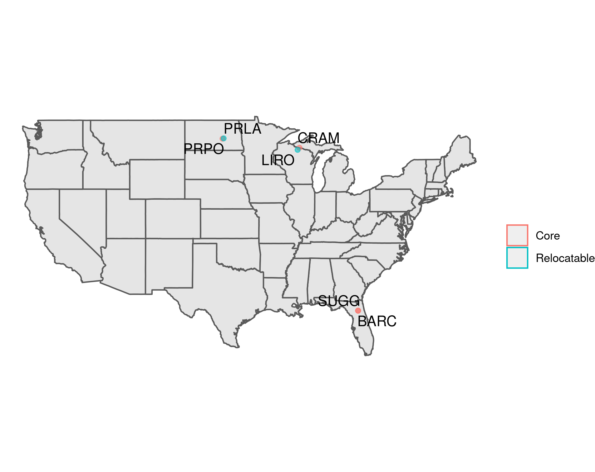
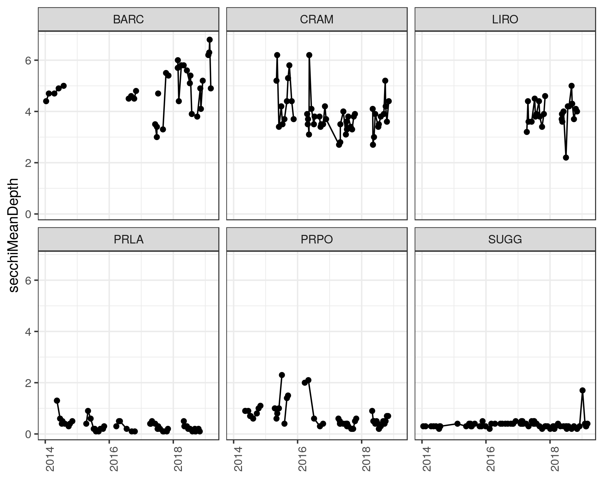

# What is the scope of NEON lakes data?

> Detailed setup files and runnable python scripts for reproducing this blog post are at: https://github.com/jsta/neon_lakes

The NEON documentation lists lakes among their targeted ecosystems. However, NEON provides so much data it can be difficult to get a grasp of their lake data apart from data collected in other ecosystems. Here, I show the scope of NEON lake data and how to get scripted access to it. In particular, I attempt to answer the question:  _**How much lake data is available through NEON and what types of data are provided?**_

## Dependencies

Before we begin, let's set up our `R` environment where the package dependencies are:

 - [geoNEON](https://github.com/NEONScience/NEON-geolocation)
 
 - [neonUtilities](https://cran.rstudio.com/package=neonUtilities)

## Walkthrough

According to the [NEON documentation](https://www.neonscience.org/field-site-subtype/lake), there are 7 NEON lake sites. We can start by mapping the location of these sites (we'll exclude `TOOK` in Alaska). We'll pull the coordinates for each site using the `geoNEON` function `def.extr.geo.os`:

```r
neon_lakes  <- data.frame( # excluding `TOOK` in Alaska
    siteID = c("CRAM", "SUGG", "BARC", "PRPO", "LIRO", "PRLA"),
      stringsAsFactors = FALSE) %>%
neon_lakes <- geoNEON::def.extr.geo.os(neon_lakes, locCol = "siteID")
```



NEON provides a [spreadsheet](https://data.neonscience.org/documents/10179/11206/NEON_data_product_status/f82f959f-b53c-44cc-ad2b-70303ac6ddc3) of data availability by type, site, and date where years represent the earliest year of data collection. Below, I've provided a rendered table of this excel sheet filtered by lake sites. The table is sorted vertically (according to variable name) from least to most data available and horizontally (according to lake site) from shortest to longest monitoring period. For example, `SUGG` secchi depth data is quite extensive whereas DNA barcoding data is fairly new and limited.

|Name                                                          |BARC |CRAM |LIRO |PRLA |PRPO |SUGG |
|:-------------------------------------------------------------|:----|:----|:----|:----|:----|:----|
|Macroinvertebrate DNA barcode                                 |2018 |2018 |2018 |2018 |2018 |2018 |
|Zooplankton DNA barcode                                       |2018 |2018 |2018 |2018 |2018 |2018 |
|Aquatic stream gauge photos                                   |2017 |2017 |2017 |2017 |2017 |2017 |
|Barometric pressure at lakes on-buoy                          |2017 |2017 |2017 |2017 |2017 |2017 |
|Chemical properties of groundwater                            |2017 |2017 |2017 |2017 |2017 |2017 |
|Elevation of groundwater                                      |2017 |2017 |2017 |2017 |2017 |2017 |
|Elevation of surface water                                    |2017 |2017 |2017 |2017 |2017 |2017 |
|Gauge Height                                                  |2017 |2017 |2017 |2017 |2017 |2017 |
|Nitrate in surface water                                      |2017 |2017 |2017 |2017 |2017 |2017 |
|Photosynthetically active radiation at water surface          |2017 |2017 |2017 |2017 |2017 |2017 |
|Photosynthetically active radiation below water surface       |2017 |2017 |2017 |2017 |2017 |2017 |
|Relative Humidity of the air above lakes on buoy              |2017 |2017 |2017 |2017 |2017 |2017 |
|Shortwave/longwave radiation on lakes (Net radiometer)        |2017 |2017 |2017 |2017 |2017 |2017 |
|Stable isotope concentrations in Groundwater                  |2017 |2017 |2017 |2017 |2017 |2017 |
|Temperature at specific depth in lakes                        |2017 |2017 |2017 |2017 |2017 |2017 |
|Temperature of groundwater                                    |2017 |2017 |2017 |2017 |2017 |2017 |
|Water quality                                                 |2017 |2017 |2017 |2017 |2017 |2017 |
|Aquatic plant bryophyte chemical properties                   |2015 |2016 |2017 |2016 |2016 |2015 |
|Aquatic plant bryophyte macroalgae clip harvest               |2015 |2016 |2017 |2016 |2016 |2015 |
|Chemical properties of surface water                          |2015 |2016 |2017 |2016 |2016 |2015 |
|Depth profile at specific depths                              |2015 |2016 |2017 |2016 |2016 |2015 |
|Dissolved gases in surface water                              |2015 |2016 |2017 |2016 |2016 |2015 |
|Macroinvertebrate collection                                  |2015 |2016 |2017 |2016 |2016 |2015 |
|Periphyton, seston, and phytoplankton chemical properties     |2015 |2016 |2017 |2016 |2016 |2015 |
|Periphyton, seston, and phytoplankton collection              |2015 |2016 |2017 |2016 |2016 |2015 |
|Riparian Vegetation Composition                               |2015 |2016 |2017 |2016 |2016 |2015 |
|Secchi depth                                                  |2015 |2016 |2017 |2016 |2016 |2015 |
|Sediment chemical properties                                  |2015 |2016 |2017 |2016 |2016 |2015 |
|Sediment physical properties                                  |2015 |2016 |2017 |2016 |2016 |2015 |
|Stable isotope concentrations in surface waters               |2015 |2016 |2017 |2016 |2016 |2015 |
|Surface water microbe cell count                              |2015 |2016 |2017 |2016 |2016 |2015 |
|Surface water microbe marker gene sequences                   |2015 |2016 |2017 |2016 |2016 |2015 |
|Surface water microbe metagenome sequences                    |2015 |2016 |2017 |2016 |2016 |2015 |
|Zooplankton collection                                        |2015 |2016 |2017 |2016 |2016 |2015 |
|Bathymetric and Morphological maps                            |2015 |2015 |2016 |2015 |2015 |2015 |
|Specific Conductivity in groundwater                          |2017 |2017 |2017 |2017 |NA   |NA   |
|Fish electrofishing, gill netting, and/or fyke netting counts |NA   |2016 |2017 |2016 |2016 |NA   |
|Air temperature of lakes on-buoy                              |2017 |NA   |2017 |NA   |NA   |NA   |
|Surface water microbe group abundances                        |NA   |NA   |NA   |2016 |2016 |NA   |
|Windspeed and direction on lakes on-buoy                      |2017 |NA   |NA   |NA   |NA   |NA   |


Let's pull data values for an arbitrary data product by finding its product ID code in the [NEON Data Product Catalog](https://data.neonscience.org/data-product-catalog) and feeding this ID to the `neonUtilities` function `loadByProduct`. Here, I pull Secchi depth measurements from each of our 6 lake sites. 

```r 
secchi <- neonUtilities::loadByProduct(dpID = "DP1.20252.001",
                                         site = neon_lakes$siteID,
                                         check.size = FALSE)
```
                                     


It looks like although there are not huge numbers of NEON lake sites, the coverage in terms of monitoring variables within a given site is quite comprehensive. Also, the `NEON` folks have done a great job making their data available via scripted access.
